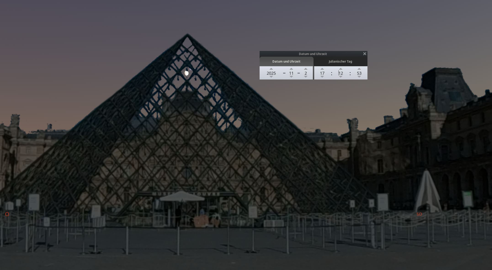

# Stellarium Landscapes

Landscapes for Stellarium, the free and open planetarium for Windows, Linux and MacOS.

https://stellarium.org/

Simply import the according `.zip` file on the landscapes screen within the application.
